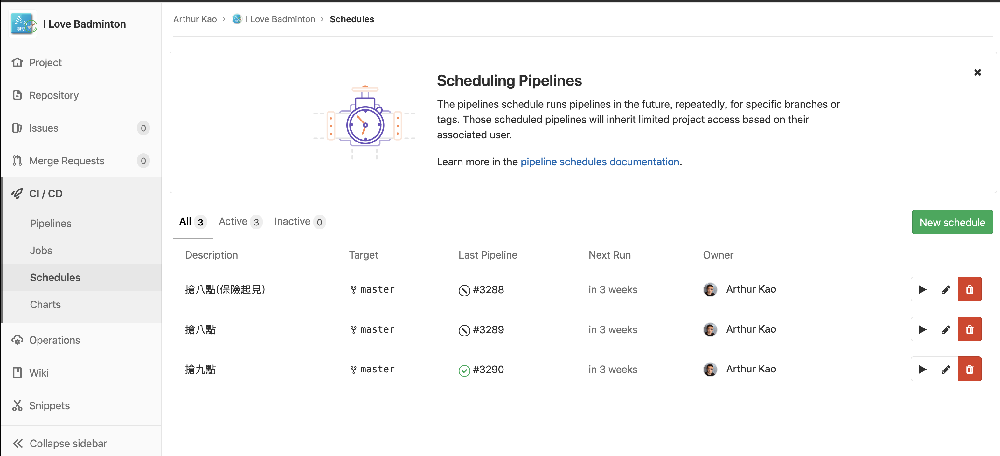
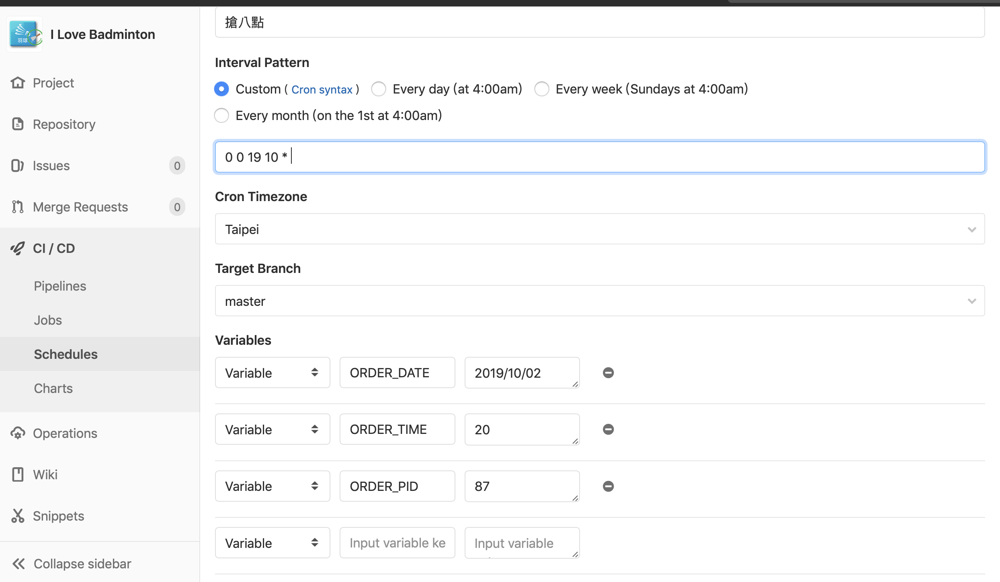

#### GitLab

CI / CD -> Schedules



設定參數



#### Local
```shell
  docker run --rm --env ORDER_ACCOUNT=${ORDER_ACCOUNT} --env ORDER_PASSWORD=${ORDER_PASSWORD} --env ORDER_DATE=${ORDER_DATE} --env ORDER_TIME=${ORDER_TIME} --env ORDER_PID=${ORDER_PID} 10.10.20.130:5000/very_bad_badminton:latest
```

#### Variables

* ORDER_ACCOUNT
  *運動中心帳號*

* ORDER_PASSWORD
  *運動中心密碼*

* ORDER_DATE
  `yyyy/MM/dd`

* ORDER_TIME
  `0~24`

* ORDER_PID

|     | 羽1 | 羽2 | 羽3  | 羽4  | 羽5 | 羽6 |
|-----|-----|-----|------|------|-----|-----|
| PID | 83  | 84  | 1074 | 1075 | 87  | 88  |